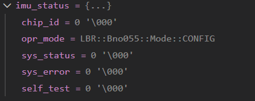
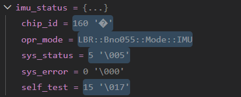
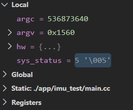
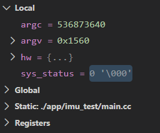
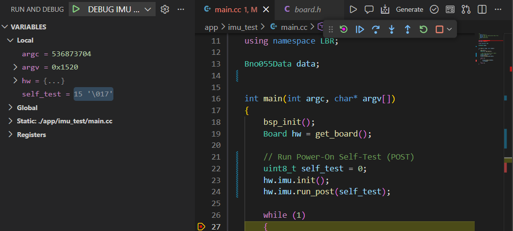

# IMU Driver Testing Procedure

This document describes all steps, methods, and evidence used to verify the IMU driver functionality. It should be updated with every change to the IMU code and used for future regression testing.

## Test Environment
- Test App: app/imu_test/
- Build Command: `./make.ps1 -t stm32l476 -c`

---

## IMU Driver Test Procedure


### 1. Initialization
**Description:** IMU initializes after power-on and after deinit
**Steps:**
1. Power cycle board
2. Run test app
3. Call init
4. Check status

**Code Snippet (should be):**
```cpp
struct ImuStatus {
    uint8_t chip_id = 0;
    Bno055::Mode opr_mode;
    uint8_t sys_status = 0;
    uint8_t sys_error = 0;
    uint8_t self_test = 0;
};

ImuStatus imu_status;
Board* hw = nullptr;

void imu_init_and_status() {
    hw->imu.get_chip_id(imu_status.chip_id);
    hw->imu.get_opr_mode(imu_status.opr_mode);
    hw->imu.get_sys_status(imu_status.sys_status);
    hw->imu.get_sys_error(imu_status.sys_error);
    hw->imu.run_post(imu_status.self_test);
}

int main(int argc, char* argv[])
{
    bsp_init();
    hw = &get_board();

    imu_init_and_status();

    return 0;
}
```

**Exptected Output:**
```
Chip ID: 0xA0 (160)
Opr Mode: 0x0C (IMU)
System Status: 0x05 (005)
System Error: 0x00 (000)
Self Test: 0x0F (017)
```

**Output in the Debug Console:**
```
imu_status = {{...}}
  chip_id = 160 '�'
  opr_mode = LBR::Bno055::Mode::IMU
  sys_status = 5 '\005'
  sys_error = 0 '\000'
  self_test = 15 '\017'
```
**Screenshot**
<table>
  <tr>
    <td><b>Before Initialization</b></td>
    <td><b>After Initialization</b></td>
  </tr>
  <tr>
    <td></td>
    <td></td>
  </tr>
</table>

---

### 2. Deinitialization
**Description:** IMU deinitializes and can be re-initialized
**Steps:**
1. Call deinit
2. Check sys_status
3. Call init again
4. Check sys_status

**Code Snippet (should be):**
```cpp
// Assume hw and imu_status are already set up as in Initialization
int main(int argc, char* argv[])
{
    bsp_init();
    Board hw = get_board();

    uint8_t sys_status = 0;

    // Initial status
    hw.imu.get_sys_status(sys_status);
   // Set breakpoint here to inspect sys_status before deinit

    // Deinit
    hw.imu.deinit();
    hw.imu.get_sys_status(sys_status);
    // Set breakpoint here to inspect sys_status after deinit

    // Re-init
    hw.imu.init();
    hw.imu.get_sys_status(sys_status);
    // Set breakpoint here to inspect sys_status after re-init

    return 0;
}
```

**Exptected Output:**
```
After Deinit System Status:  0x00
After Re-init System Status: 0x05
```

**Output in the Debug Console:**
```
sys_status = 5 '\005' 
↓
sys_status = 5 '\000'
↓
sys_status = 5 '\005' 
```
**Screenshot:**
<table>
  <tr>
    <td><b>Init</b></td>
    <td><b>Deinit</b></td>
    <td><b>Re-Init</b></td>
  </tr>
  <tr>
    <td></td>
    <td></td>
    <td></td>
  </tr>
</table>
---

### 3. Data Read
**Description:** IMU data can be read and is valid
**Steps:**
1. Call read after init
2. Check data range
3. Check `CORTEX LIVE WATCH`

**Code Snippet:**
```cpp
Bno055Data data;
int main(int argc, char* argv[])
{
    bsp_init();
    Board hw = get_board();
    while (1)
    {
        hw.imu.read_all(data);
        (void)data;
    }
    return 0;
}
```
**Expected Output:**
```
accel: x, y, z (m/s²)
gyro: x, y, z (°/s)
linear_accel: x, y, z (m/s²)
gravity: x, y, z (m/s²)
quat: w, x, y, z *

* : unitless (normalized; represents orientation)
```
**Picture/Screenshot:**
<table>
  <tr>
    <td><b>Cortex Live Watch</b></td>
    <td><b>Data Read **</b></td>
  </tr>
  <tr>
    <td></td>
    <td><a href="https://youtu.be/xHdkIVHeq-s" target="_blank">Watch IMU Test Video</a></td>
  </tr>
</table>

** : Data should constantly change in `Cortex Live Watch` as IMU sensor moves in different orientation.

---


### 4. Error Handling
**Description:** Driver handles errors (bad config, bus failure, disconnect, etc)

**Steps:**
1. Disconnect the IMU (physically or via code)
2. Attempt to initialize or read from the IMU
3. Check and log error status

**Code Snippet:**
```cpp
// Simulate IMU disconnect and handle error
/* In this case, we deinit() is written wrong that will triggered the sys_error */
hw.imu.deinit(); // Simulate disconnect 
uint8_t sys_status = 0;
uint8_t sys_error = 0;
hw.imu.get_sys_status(sys_status);
hw.imu.get_sys_error(sys_error);

```

**Expected Output/Log:**
```
System Status: 0x01
System Error: 0x03


```

**Video:**
<a href="https://youtu.be/AC2RkIc5v-8" target="_blank">Watch IMU Error Handling Test</a>

---


### 5. Self-Test Functionality
**Description:** IMU self-test (POST/BIST) passes and reports status

**Steps:**
1. Call the self-test function after initialization
2. Read and log the self-test result
3. Confirm all self-test bits are set 

**Code Snippet:**
```cpp

uint8_t self_test = 0;
hw.imu.run_post(self_test);
```

**Expected Output:**
```
IMU self-test passed: 0x0F 
``` 
or if any test fails:
```
IMU self-test failed: 0x0C
```

**Picture/Screenshot:**



